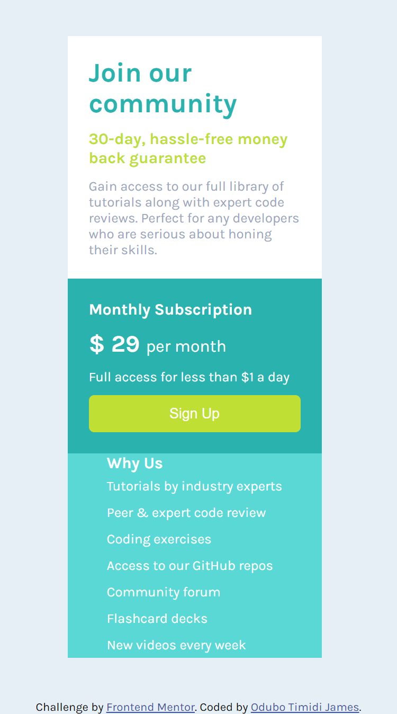

# Frontend Mentor - Single price grid component solution

This is a solution to the [Single price grid component challenge on Frontend Mentor](https://www.frontendmentor.io/challenges/single-price-grid-component-5ce41129d0ff452fec5abbbc). Frontend Mentor challenges help you improve your coding skills by building realistic projects. 

## Table of contents

- [Overview](#overview)
  - [The challenge](#the-challenge)
  - [Screenshot](#screenshot)
  - [Links](#links)
- [My process](#my-process)
  - [Built with](#built-with)
  - [What I learned](#what-i-learned)
  - [Continued development](#continued-development)
  - [Useful resources](#useful-resources)
- [Author](#author)
- [Acknowledgments](#acknowledgments)

**Note: Delete this note and update the table of contents based on what sections you keep.**

## Overview

### The challenge

Users should be able to:

- View the optimal layout for the component depending on their device's screen size
- See a hover state on desktop for the Sign Up call-to-action

### Screenshot

### Links

- Solution URL: [Link to the site](https://github.com/timidij/singleprice.git)
- Live Site URL: [live site URL here](https://merry-tulumba-30c4aa.netlify.app/)

## My process

### Built with

- Semantic HTML5 markup
- CSS custom properties
- Flexbox
- desktop -first workflow

- [Styled Components](https://styled-components.com/) - For styles

### What I learned
I learnt making use of flex to style my page layout, I did the desktop first before designing mobile.
I divided the page into two section divs... when I did the mobele design I noticed that width of the top and middle did not align as espected. I had to use the flex property stretch to make it equal.

### Continued development

using grid instead of flexbox to design the layout

### Useful resources

- [Example resource 1](https://www.w3schools.com/css/css3_flexbox.asp) - this linkk provided insight into flexbox properties and how the can be used to achieve different layout.

## Author

- Frontend Mentor - [@timidij](https://www.frontendmentor.io/profile/timidij)
- Twitter - [@OduboJames](https://www.twitter.com/OduboJames)

